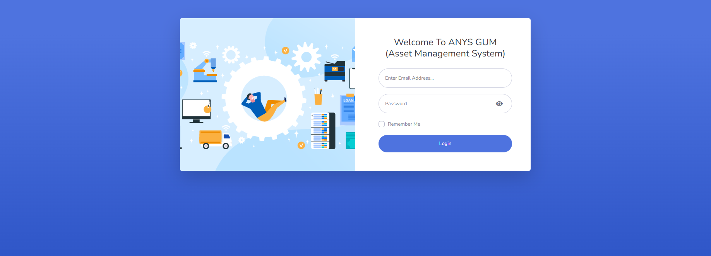
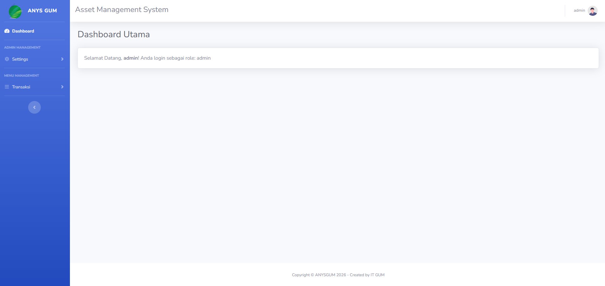
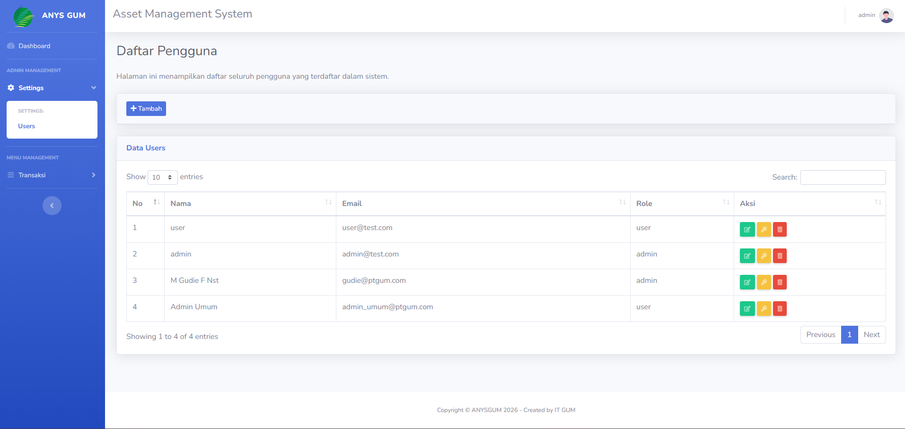
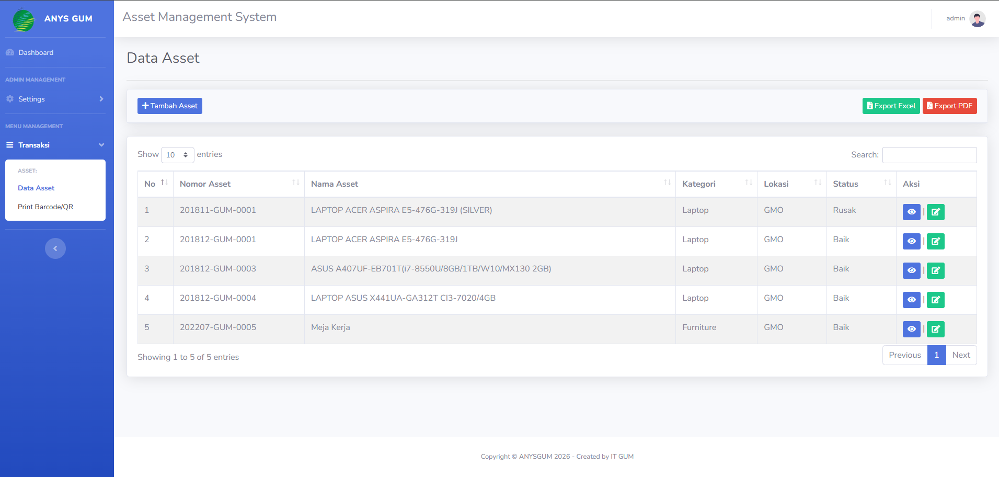
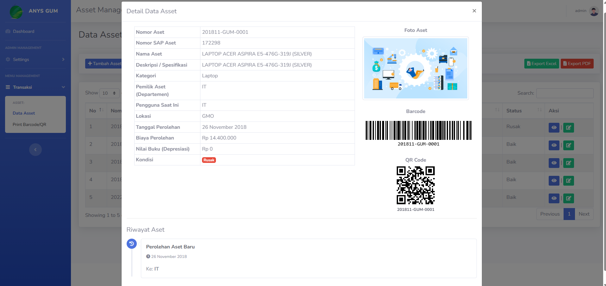
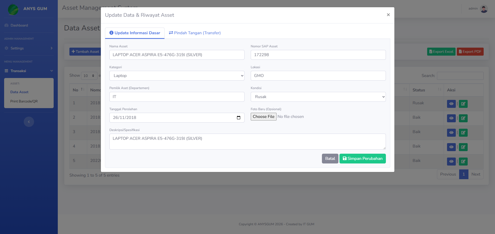
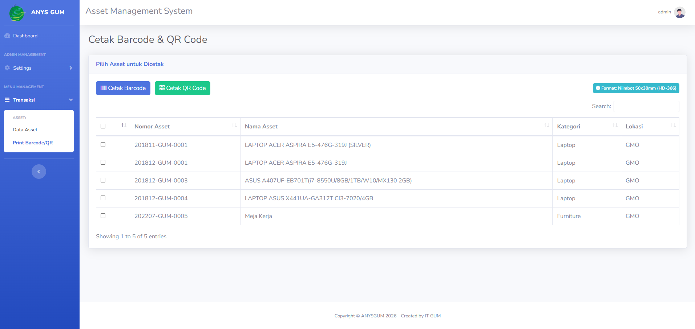

## About Laravel

Laravel is a web application framework with expressive, elegant syntax. We believe development must be an enjoyable and creative experience to be truly fulfilling. Laravel takes the pain out of development by easing common tasks used in many web projects, such as:

- [Simple, fast routing engine](https://laravel.com/docs/routing).
- [Powerful dependency injection container](https://laravel.com/docs/container).
- Multiple back-ends for [session](https://laravel.com/docs/session) and [cache](https://laravel.com/docs/cache) storage.
- Expressive, intuitive [database ORM](https://laravel.com/docs/eloquent).
- Database agnostic [schema migrations](https://laravel.com/docs/migrations).
- [Robust background job processing](https://laravel.com/docs/queues).
- [Real-time event broadcasting](https://laravel.com/docs/broadcasting).

Laravel is accessible, powerful, and provides tools required for large, robust applications.

## Assets Management System GUM (ANYS)

Projek yang di bangun menggunakan laravel 12 , PHP 8.2, dan database PostgreSQL 15
Projek ini merupakan aplikasi manajemen data aset sederhana dengan fitur:
- Login
- Dashboard
- User Account
- Data Asset
- Histori Pindah Tangan Asset
- Print Label

## Instalation

1. Clone repository ini ke projek anda
2. Composer Install
3. edit file .env untuk setup database
4. php artisan migrate
5. php artisan key:generate
6. php artisan serve

## Documentation Apps

Login Page 

Dashboard Page

User Account Page

Data Asset Page

Print Label Page

## License

The Laravel framework is open-sourced software licensed under the [MIT license](https://opensource.org/licenses/MIT).
